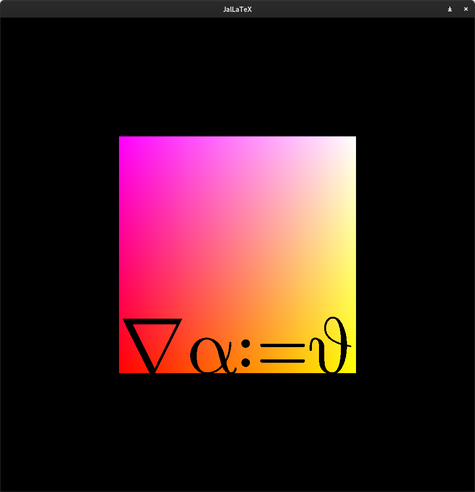
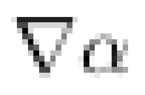
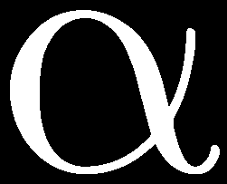

# Goal
- rasterize bezier curves
- rasterize text _properly_
- plots
- performance is not a goal; correctness is.
    - rationale: I'm not trying to rasterize all of wikipedia, workloads will be relatively small

# Bézier curves background
### Definition
- bezier curve
- spline as seq of bezier curves

### Rasterization
- software rasterization is trivial: map over t
- hardware rasterization is slightly harder:
    - (x, y) is on the curve if B(t) - (x, y) = 0
    - amounts to solving a polynomial equation


# Font loading
- used ttf_parser to parse files
- used ruztybuzz for shapign; port of harfbuzz's shaping algo

# Glyph rasterization
The first step of glyph rasterization is to convert the FreeType-strokes into cubic Bézier curves. It would simplify matters _massively_ to restrict ourselves to _quadratic_ Bézier curves, and indeed this is what most material online does, and this is perfectly fine if restricting ourselves to _TrueType_ fonts, as these are simply made up of quadratics, but the problem is that _OpenType_ fonts use _cubic_ curves, so restricting ourselves to quadratics means we either have to choose a different font (the \LaTeX-font is `.otf`) or _approximate_ the cubic Bézier curves. To be clear, this approximation of one lower order can be done quickly and accurately, so it is an interesting option should we meet performance problems with the high-order techniques.
It is possible to obtain `.ttf` versions of the \LaTeX-font online, but for the sake of argument, lets assume we want to maybe let the user configure the font, then restricting to `.ttf` is not super user-friendly.

The next step, once the Bézier curves have been computed from the font, is to _fill_ the character. This turns out to be fairly non-trivial, mostly because we use cubics.
What we want is a way to check -- independently -- if a point lies within the boundary of the glyph (independent because we want to do it in a fragment shader, of course).
There are numerous ways to do this, many of which are described online.
A popular approach for 3D graphics systems that need performance _at all costs_ use an approach known as _signed distance functions_, which are (pre-)computed for rasterized glyps which lets you quickly approximate a fragments position relative to the curve at runtime, but at the cost of loss of detail -- sharp features are rounded out. This is precisely what we _don't want_ since the \LaTeX-font has extremely thin serifs.
Another common approach is to make use of the _winding number_ for a given point, and this is what I will do.

The principle is fairly simple, but the result is suprising: No matter if a glyph has holes or non-convex boundaries, the correct winding-number can be calculated by checking for intersections along _any_ ray emitting from a point.
As far as i can tell, this is known as Dan Sunday's winding number algorithm.
A description of something similar (in the context of glyph rendering) is given [here](https://wdobbie.com/post/gpu-text-rendering-with-vector-textures/).
This requires us to know two things: How do we know if a Bézier curve intersects with an arbitrary line -- say a horizontal line?
And how do we know which _direction_ the line is going at this point?
Essentially, for a given Bézier curve $B(t)$, for which $t$ is $B_y(t) = 0$,
and what is $dB_y / dt$ at this $t$?

An alternate representation for the (cubic) Bézier curve $B$, which is typically most readily expressed by linear interpolation between its control points
$P_0, P_1, P_2, P_3$ is via _Bernstein polynomials_,

$$
\arraycolsep=0.1em
\begin{array}{rcllll}
B(t) & = & P_0 &   & (1 - t)^3 &  \\
     & + & P_1 & 3 & (1 - t)^2 & t  \\
     & + & P_2 & 3 & (1 - t)   & t^2  \\
     & + & P_3 &   &           & t^3 
\end{array}
$$

which as you can see, is just a linear combination of the control points, each weighted by
polynomials of that "trade off" between $t$ and $t-1$. That's very pretty, but doesn't
help us much in finding the roots. We rearrange in terms of powers of $t$:^[By using
WolframAlpha or somthing like that of course]

\begin{align*}
B(t) &=  P_0 \\
     &+ (- 3 P_0 + 3 P_1)t \\
     &+ (3 P_0 - 6 P_1 + 3 P_2) t^2 \\
     &+ (-P_0 + 3 P_1 - 3 P_2 + P_3) t^3
\end{align*}

## Solving the cubic
Solutions to cubic equations like $B(t) = 0$ has an explicit formula, akin to the famous quadratic formula,
just a little bit hairier. I will provide an explanation of how to get $B(t)$ in a standardized
form to apply the formula, because it is a central part of the fragment shader, but the details
are really not super important: The important thing is that the _is a way_ to find the roots
in constant time with a reasonable number of floating point operations, so feel free to gloss
over. Sometimes I might introduce things without proof or motivation for brevity.
A very nicely motivated explanation of this formula is given in
[a highly entertaining YouTube video by Mathologer](https://www.youtube.com/watch?v=N-KXStupwsc).

Recalling that $P_1 \dots P_3$ are just 2D points that we are interpolating between,
the $y$-coordinate of the interpolated point can be obtained simply by interpolating 
between $y_1 \dots y_3$. (If this is unclear, think of a point $P$ as a linear 
combination of its $x$- and $y$-component, and remember that scaling and adding 
preserves linear combinations).
Making the substitutions
$c = y_0$,
$b = - 3 y_0 + 3 y_1$,
$a = 3 y_0 - 6 y_1 + 3 y_2$, and
$d = -y_0 + 3 y_1 - 3 y_2 + y_3$,
we thus have
\begin{align*}
B_y(t) &= d t^3 + a t^2 + b t + c \\
\frac {dB_y} {dt} &=
    3d t^2 + 2a t + b
\end{align*}
which is finally starting to look sensible.
Noting that multiplying by a constant does not change the roots, and
that we do not care about the magnitude of the derivative, only the sign, we divide through by $d$ to get:
\begin{align}
B_y(t) &=  t^3 + a t^2 + b t + c \\
\frac {dB_y} {dt} &=
    3 t^2 + 2a t + b
\end{align}

Next, we introduce a standard coordinate shift
$$
t = s - \frac a 3 \implies B(s) = s^3 + ps + q
$$
where
$$
p = \frac {3 b - a^2} 3 \quad \text{and} \quad q = \frac {2a^3 - 9ab + 27c} {27}
$$
and solutions to _this_ polynomial (almost) has a neat explicit formula. The discriminant
$$
\Delta = \left(
    \frac q 2
\right)^2
+ \left(
    \frac p 3
\right)^3
$$
tells which of a few special cases we have:
$\Delta < 0 \implies \text{three real solutions}$,
$\Delta = 0 \implies \text{two real solutions}$, and
$\Delta > 0 \implies \text{one real solution}$.
The $\Delta \geq 0$ cases are simple: The formula for the solution $s$ can be expressed using $\sqrt \Delta$:
\begin{equation}
u = \sqrt[3]{
- \frac q 2 - \sqrt \Delta
}
\quad\text{and}\quad
v = \sqrt[3]{
- \frac q 2 + \sqrt \Delta
}
\end{equation}
and the solutions are
\begin{equation}
s_1 = u + v
\quad\text{and}\quad
s_{2,3} = - \frac 1 2 (u + v) \pm (u - v) \frac {\sqrt 3} 2 i
\end{equation}
To see how this gives one and two real solutions, notice that in the $\sqrt \Delta = 0$ case,
$u = v \implies u - v = 0$, so one of the complex solutions "becomes" real, thus giving us another.


However, in the $\Delta < 0$ case (in which, remember, we have three _real_ solutions), $\sqrt \Delta$
will always be a _complex_ number. In fact, all three solutions are actually sums of _complex
conjugates_! Our formula still technically gives correct answers, but it is _annoying_ do do in a shader
because representing $u$ and $v$ as complex numbers requires implementing the basic arithmetic
ourselves. We can circumvent the complex arithmetic entirely by writing the conjugates in polar
coordinates:
$$
r = \sqrt { \left(
- \frac  p 3
\right) ^3}
\quad \text{and} \quad
\vartheta = \mathrm{atan2} \left(
\sqrt {-\Delta}, - \frac q 2
\right)
$$
In which case our solutions are
\begin{align}
\begin{split}
s_0 &= 2 \sqrt[3] r \cos \frac {\vartheta} 3 \\
s_1 &= 2 \sqrt[3] r \cos \frac {\vartheta + 2 \pi} 3 \\
s_2 &= 2 \sqrt[3] r \cos \frac {\vartheta + 4 \pi} 3
\end{split}
\end{align}
and to get our solution back in terms of $t$, simply apply the coordinate shift $t = s - a / 3$
again.

Now, the algorithm to calculate a point $P$s winding number in a region $\Omega$
outlined by the a Bézier spline $(B(t))_i$ simply amounts to finding
the solutions $t$ for $B_y(t) = P_y$ such that $B_x > P_x$.
Intuitively: All the points where a ray eminating from $P$ towards positive $x$ 
direction crosses the boundary.
We characterize these solutions based on whether they are _leaving_ or _entering_ $\Omega$.
The convention based on the orientation of $B$ is that the interior of $\Omega$ is always
"to our left", in other words if $dB_y / dt > 0$ (the curve is "moving upwards") the ray is _leaving_
$\Omega$, and analogously if $dB_y / dt < 0$ the ray is _entering_ $\Omega$.

Arbitrarily, we may for example say that a solutions contribution to the winding 
number should be +1 if the ray is entering $\Omega$, and -1 if leaving.
With this convention, fragments with negative winding numbers are _inside_ $\Omega$.
Intuitively: If the winding number is negative, we have _left_ more often than we have _entered_,
so in sum the ray eminating from this point is _leaving_ $\Omega$, and thus the point is inside.


To summarize, we can rasterize a region $\Omega$ outlined by a spline
$(B(t))_{i=0}^n$ in $O(n)$ time where $n$ is the number of Bézier curves in the spline.
That sounds fantastic, and it almost is! But there is a big prpblem:
The calculation outlined suffers badly from numerical precision!
Particularily where Bézier curves are joined in points that are tangent to the
ray.


Since this artefacting stems from numerical imprecision, it is extremely
sensitive to translation of the glyphs. In fact, the position of the nice-looking $\alpha$ was _very_ carefully
selected so as to not have any visible artefacts. In other words, while mathematically correct,
this technique is not _quite_ feasible. Thankfully, it is not that hard to salvage.
[a paper by Eric Lengyel](https://jcgt.org/published/0006/02/02/paper.pdf) describes
an incredibly elegant lookup-table based way to compute the winding number.
This approach requires restricting our curves to quadratics after all.
Perhaps delving into all these calculations was a waste of time, but i think outlining
the problems of this approach in detail is valuable. I also think it is important to document
the things I have learned that _didn't_ make it into the final implementation.
Anyways, our next task is splitting cubic spline segmments into quadratics.
This is outlined for the general case in
[an online article](https://www.sirver.net/blog/2011/08/23/degree-reduction-of-bezier-curves/),
but we have it easy since we have a specific order in mind.


## Degree reduction of Bézier curves
In the general case, the matrix $\mathrm M$ that lifts a Bézier curve from
degree $n-1$ to degree $n$ is $n + 1 \times n$. Think about it: We want to apply
the matrix to $n$ control points and get $n + 1$ control points.
If we were to raise quadratic curves ($n-1=2$) we would need a $4 \times 3$ matrix.
$$
\renewcommand\arraystretch{1.3}
\mathrm M = \begin{pmatrix}
1         &           &            \\
\frac 1 3 & \frac 2 3 &            \\
          & \frac 2 3 & \frac 1 3  \\
          &           &         1  \\
\end{pmatrix}
$$
We make use, without proof, of the fact that
\begin{equation}
B_{n-1} = (\mathrm M ^T \mathrm M)^{-1} \mathrm M ^T B_{n}
\end{equation}
but note that since the dimensions are given, the product can be pre-computed:
$$
\mathrm M' \coloneqq \frac 1 {20} \begin{pmatrix}
19 & 3 & -3 & 1 \\
-5 & 15 & 15 & -5 \\
1 & -3 & 3 & 19
\end{pmatrix}
$$
and
\begin{equation}
\mathrm M' \begin{pmatrix}
P_0 \\ P_1 \\ P_2 \\ P_3
\end{pmatrix}
= \frac 1 {20} \begin{pmatrix}
19 P_0 +  3 P_1 -  3 P_2 +    P_3 \\
-5 P_0 + 15 P_1 + 15 P_2 -  5 P_3 \\
   P_0 -  3 P_1 +  3 P_2 + 19 P_3
\end{pmatrix}
\end{equation}
Not exactly pretty! But how does it perform?


It is _awful_! :-) Even though it is a "good" approximation, this strategy even moves the
end-points.
Now, there are better ways to do this, by for example splitting the high-order curve into low-order
curves and calculating a low-order curve based on points on the line, for example at
$t=0,t=0.5,t=1$, but that sounds like an awful amount of work when `.ttf` versions of the font is
easy to generate with something like FontForge. Now, I wrote earlier that i wanted to use
`.otf` fonts as a possibility so we can be maximally flexible with the users choice of fonts, but
that sounds like a problem for future me!


With fonts converted with FontForge the result is indistinguishable from the higher order.
In fact, lower-order approximations can be done to arbitrary precision, FontForge has just inserted
way more curves!

## Bézier curve equivalence classes
I think outlining how this winding number calculation works is worth a section, even though all the math is
a lot simpler compared to the cubic case I just described, and the LUT is just implemented verbatim
from the referenced article. The LUT solution is so _mind-bogglingly clever_ that I can't help
myself.

First of all, the Bernstein polynomial representation of a quadratic Bézier curve is
$$
\arraycolsep=0.1em
B(t) = 
\begin{array}{cllll}
  & P_0 &   & (1 - t)^2 &  \\
      + & P_1 & 2 & (1 - t)   & t  \\
      + & P_2 &   & (1 - t)   & t^2  \\
\end{array}
= \begin{array}{cll}
    &     P_0                &   \\
  + & (-2 P_0 + 2 P_1)       & t \\
  + & (   P_0 - 2 P_1 + P_2) & t^2
\end{array}
$$
which clearly means that given
$a \coloneqq P_0 - 2P_1 + P_2$,
$b \coloneqq -2 P_0 + 2 P_1$, and
$c \coloneqq P_0$,
\begin{equation}
t_{1,2} = \frac {-b \pm \sqrt {b^2 - 4ac}} {2a}
\end{equation}
The winding number is then calculated in the same way:
Given a point P, imagine a ray in (for example) positive $x$-direction,
find all the intersections, categorize them based on whether we are entering or leaving $\Omega$,
and sum up. But instead of doing the error-prone numerical categorization, there is a genius 
trick we can employ to categorize the solutions. If we calculate `jmp` as follows:
```Rust
// Calculate the jump:
let jmp = if y0 > 0.0 { 8 } else { 0 }
        + if y1 > 0.0 { 4 } else { 0 }
        + if y2 > 0.0 { 2 } else { 0 };
```
Notice that for any distinct combination of point configurations (configuration, in this context,
meaning whether a point is "above" the ray or not  -- i.e. whether $y > 0$), `jmp` will take
distinct values from $\{ 0, 2, 4, 6, \dots, 14\}$. For example, if $P_0, P_1$ is above,
and $P_2$ is below the ray, `jmp = 12`. The LUT is implemented as follows:
```
let class = 0x2E74 >> jmp;
```
Yes -- it's that simple.
The table is organized such that after shifting the binary number $\color{orange}10 \color{blue}11 \color{orange}10 \color{blue}01 \color{orange}11 \color{blue}01 \color{orange}00$,
the _lowest two bits_ tells us how to interpret our two solutions $t_1$ and $t_2$.
In other words, it defines _equivalence classes_ of Bézier curves based on the layout of their 
control points, and a Bézier curves equivalence class determines if a solution should count
towards the winding number.


Now, armed with an algorithm that doesn't suck, we are ready to take on the GPU.

# Hardware-accellerated rasterization
The plan is as follows: Let a "text-box" be represented by a single quad,
and put all the Bézier curve control points in a uniform buffer.
We bake two unsigned integer-attributes into the vertex defning the range of
Bézier curves that is part of text in its box to restrict the loop in the fragment shader.
I'm not _exactly_ sure how the GPU executes such code;
since it is a SIMT architecture, at the very least all the threads will be waiting
for the longest loop. I'm not sure how the memory access works when all the threads
have a different loop counter and is accessing different parts of the buffer,
if different threads in the same block can cache different parts of the uniform buffer and so on.
There might not be much benefit to such optimization, I'm choosing to remain optimistic however.

The main challenge is the volume of uniforms: For a large box of text, there might
be _tens of thousands_ of curves. A single $\alpha$ has 41 quadratic bezier curves,
and a single curve has 3 points $\times$ 2 coordinates $\times$ 4 bytes $=24$ bytes.
Some random website said that a page of text generally contains $\sim 3000$ characters,
in other words a pages worth of text could contain $3000*41*24$ bytes, approximately
3 _megabytes_ of curves.
We could of course split our text into multiple draw-calls, but that doesn't really
_solve_ the problem: All the data still needs to be fed to the GPU, and that just
introduces more costly state transitions and overhead. Almost certainly, sending
that much data would be faster to do in one go. Uniform buffer objects can only
store (at least as per defined by the spec) 16KB.
Needless to say, we need some other strategy for handing off data to the GPU.
And on a similar note, a lot of the time the data will not actually change from
drawcall to drawcall: Translating text around the screen will of course be done
by applying affine transformations to the text-box quad, never actually touching
the curves, we only need to hit the curve buffer if the text itself changes,
and this would be a significant CPU time-save.
So how do we do achieve both support for _large_ buffers, and persistance across
pipeline invocations?

SSBOs -- Shader Storage Buffer Objects -- seem very appealing, these buffers
provide at least 128MB (as per the spec, in reality usually arbitrarily large),
and can also be dynamically sized; a single buffer oject doesnt have a (compile-time)
static size, like uniform buffers do.
It also persists across multiple invocations of the rendering pipeline, and supports
partial updating, so we only have to waste CPU-time sending data when something changes,
and there is theoretically a potential to be a bit smart and just send deltas.
This is very cool, and is core since OpenGL 4.3, which means it is fair game
for this project as it's meant to use modern OpenGL. But, this means our program can no longer work on MacOS.
Sucks to suck i guess.



Figure \ref{fig:first_gpu} shows the first successful run of a minimal working such shader.
It is done in a very primitive way, by just using $uv$-coordinates and checking the winding number
for each $uv$ with the Bézier curves scaled down with a hard-coded constant to fit in the quad.
I will deal with text composition in a quad _properly_ later, for now that is not the most pressing issue.
You can clearly see, particularly when rasterizing very small glyphs, that aliasing is a significant issue.
Especially _thin_ and _curved_ segments of glyphs look extremely bad.


Since we are not sampling a triangle directly for our fragment color, but instead calculating it based on
curvy math, we have no straight-forward way to make use of OpenGL multisampling.
We therefore have to calculate the anti-aliasing ourselves, and as with all other text-related business,
this turns out to be an acrcane art.

# Quality font rendering
Beyond simple anti-aliasing, there are a lot of tricks to improving the legibility of rasterized fonts, most motably
_hinting_ and _subpixel rendering_. Hinting essentially boils down to _adjusting_ the bezier curves surrounding the
glyph to align with the pixel grid. This gives small font sizes crisper edges, but _changes the shape_ of the font.
For this reason it is slightly controversial, between people favoring clear edges, and people favoring representing
a rasterized glyph as the best possible approximation of what the type designer intended.
On modern, high-resolution displays -- generally speaking -- hinting does next to nothing.
If a character is big enough to be legible, even thin bits will contain several sample points, and thus aligning
the curves to the sample points is pointless. I will not attempt to implement hinting.

Subpixel rendering would be a nice goal, but since it relies on basically exploiting the physical layout of
a pixel on the screen, and _coloring_ a pixel to light up a speficif fraction of it, this introduces assumptions
about the users monitor. Personally, I have one monitor which is rotated vertically, and one which is not,
so subpixel rendering _just doesnt work_. If i moved a window between monitors, the text would look horrible.
Furthermore, this is just not necessary on modern high resolution displays.

\begin{table}[t]
\begin{center}
\begin{tabular}{ccc}
\hline
\hline
\scshape 1 Sample & \scshape 4x MS & \scshape 16x MS \\
\hline
\includegraphics[width=.25\columnwidth]{report/aa_test/big_1.png} & 
\includegraphics[width=.25\columnwidth]{report/aa_test/big_4.png} & 
\includegraphics[width=.25\columnwidth]{report/aa_test/big_16.png} \\

\includegraphics[width=.25\columnwidth]{report/aa_test/medium_1.png} & 
\includegraphics[width=.25\columnwidth]{report/aa_test/medium_4.png} & 
\includegraphics[width=.25\columnwidth]{report/aa_test/medium_16.png} \\

\includegraphics[width=.25\columnwidth]{report/aa_test/tiny_1.png} & 
\includegraphics[width=.25\columnwidth]{report/aa_test/tiny_4.png} & 
\includegraphics[width=.25\columnwidth]{report/aa_test/tiny_16.png} \\
\hline
\end{tabular}
\end{center}
\caption{Various levels of anti-aliasing, for various font-sizes.}
\end{table}

In the following tabe, I have presented some samples of the black-and-white anti-aliasing.
The 4x multi-sampling is done with slightly rotated points (approximataly $30^\circ$ relative to the
pixel grid). If they are aligned horizontally, you get this strange effect where a pair of points
will either be both inside, or both outside of near-horizontal or -vertical lines.
I want to do this for the 16x multi-sampling too, but I haven't been able to find any articles
describing a sensible point-distribution, whereas for 4x multi-sampling i found a point distribution
in the Vulkan documentation.



For the record, above is how the same text, with a similar font size, renders in Evince,
a pretty standard PDF-reader that presumably uses FreeType. As you can see, there is probably
some hinting going on, as the top of the $\nabla$ is quite sharp, and the bottom of the
$\alpha$ is oddly straight. This is because it has been "massaged" into the pixel grid.
Do note how much more closely the non-hinted version of $\alpha$ resembles the original design of the glyph!
All in all, I don't think I'm doing so bad in comparison.

Sampling 16x is obviously fairly expensive. Especially given that sampling requires a fairly
high number of floating point operations to calculate the solution of a bunch of polynomials.
But I think modern GPUs are easily more than capable of this, even for absudrly high curve counts.
I would say that this rasterization is of sufficient quality, and move on.

# Typesetting 101
In order to produce text elements that can be processed by the graphics pipeline, it is necessary
to calculate, given a certain piece of text, what its bounding box is, what its $uv$-density is,
and so on -- $uv$-density in this context being the linear relationship between $uv$-coordinate
and a unit text-size, needed for example when calculating offsets for the sameple points when multisampling.

Essentially, we need a way to control positioning and size of text.
There are a few points to consider: If we place two text elements side by side, we certainly
want their _baseline_ to line up. Thus, if we consider the bottom left corner of the bounding 
box of the Bézier spline the origin, text elements with _descenders_ will be mis-aligned:


People familiar with \LaTeX will most certainly have stumbled across the `em` measurement.
This is the basic unit of measure in typography.
Fonts, however, are specified in "some other" unit of measurement, and the scale can vary from font to font.
Thankfully it is possible to query the font for its `units_per_em`.
It is possible to query for a fonts ascender-, capital- and descender-height, but fonts may be designed
to overshoot these, especially with accents in mind, so this is not reliable for this purpose.
The most reliable thing to do is to accumulate $\min y$ and $\max y$ as we outline the shaped text,
making sure to round correctly acountign for anti-aliasing.

Okay, _so what does font size actually mean_?
Normally, you specify a font size in terms of "dots", dots being \sfrac{1}{72} of an inch (great...).
The window size is measured in pixels, and we have no real way of knowing what an "inch" is.
`winit`, and therefore also `glutin`, does not expose the DPI in any sensible way, and for a very good reason.
_As far as i know_ the DPI isn't even something that is precisely set most of the time. Moreover, if you change 
the resolution of your monitor, a "12-point" font will look bigger, _despite the fact_ that 12 points are 
"supposed" to be \sfrac{12}{72}s of an inch. This is -- of course -- because _a pixel is not a dot_.
Without a context tying your text to a _literal sheet of paper_, (like a page in Microsoft Word)
a "dot" is a meaningless measurement. So what is the "correct" thing to do?

Long story short: Microsoft decided that the answer is 96 pixels per inch.
In other words, 1 pixel is \sfrac{4}{3} dots. This is the assumption all programs apparently make.
and to deal with high-DPI monitors, we query `glutin` for its `hidpi_factor` to scale.

Okay. 1em is the point-height of a font, in other words, if we are using a 12-point font,
$1\text{em} = 12\text{pt} = 16 \text{pixels}$, ignoring any possibility of zooming.
If we store the quad in units of 1em, we would have an intuitive way to set the font size
by applying a scaling "model" matrix to the text element -- just scale by $\sfrac{96}{72} \times \text{font size}$.
Calculating 1em is easy -- just query the font database for ascender- and descender-heights and subtract.
This is the value our vertex coordinates need to be normalized to.
The origin is _at the baseline_, on the left side of the box, meaning that to place text,
apply a translation matrix to the coordinates you want the baseline to be.
It might be attractive to place the origin a the center of the textbox to make rotation easier,
but the problem is that it isn't clear what is the "vertical center" of the text.
For most "normal" text in mixed-case, I suspect rotating around the center relative to x-height
is the most appealing, but if you have text in all caps, that's probably not the case. Either way,
you can get whatever reference point you want by calculating a simple matrix.

It might seem overkill to reach for matrices simply to scale and position a 2D quad, but I'm reading
into the future here, where we want to position text-elements relative to others.

\section{Transformation-invariant \\ Anti Aliasing}

In the anti-aliasing example, the offset between sample points were hard-coded to correspond to
that specific screen resolution and that specific glyph scaling.
If we apply a transformation to our text-element, we need to adjust the sampling.
Think about it: If we are sampling in units of 1em, and we stretch out the text box,
1em will be further away in pixel terms, so we need to "compress" the area we take samples in.

Thankfully this is pretty simple: The model matrix is what scales our text from units of 1em
to pixels. If we apply the non-translatory part of this to the basis $\{\hat u, \hat v\}$, the lengths of these
vectors will tell us how many pixels is equivalent to 1em, regardless of any rotation that might be
going on.
\begin{equation}
1\text{em} = \left| \mathrm M _{3 \times 3} \hat u \right| \text{px}
\implies
\Delta u = 1\text{px} = \frac 1 {\left| \mathrm M _{3 \times 3} \hat u\right|}
\end{equation}
Is the width of one pixel in the coordinate system of the Bézier curves, and
similar for $\Delta v$, the _height_ of a pixel.
It is convenient to think of sample points in a pixel as points in the set
$[-1, 1] \times [-1, 1]$, which has twice the width and height, so to acommodate this,
in practise we use half of $\Delta u$ and $\Delta v$.
If using a perspective projection, you would also need to account for the fragments depth $z$.


The results are pretty good. With this working, it should finally be possible to render text
elements in a scene-graph and have it basically "just work".

# Scalability
Now, as we are able to draw arbitary text on a quad, and position it on a screen, we can in
principle draw arbitrary amounts of text, and even though my workloads are planned to be only
moderate, I think it is worth reflecting a bit on performance.
Currently, for every glyph drawn, I send the glyphs curves to the GPU, positioned in the text
elements $uv$-coordinate system.
That means, that if I'm rasterizing "$\vartheta \vartheta \vartheta$", the curves of $\vartheta$
are duplicated three times.
The advantage of this method, is that -- assuming the text is static -- making the draw call
has _zero_ bandwidth overhead, all we need to send is the vertex data and uniforms, since
the final shaped text lives on the GPU.

On the flip side, modifying the text is complicated.
If you want to replace a glyph, the replacement might have more Bézier curves than the original,
so even though its possible to do partial updates on the SSBO, it would likely involve
re-positioning all curves that come after this glpyh to make it fit into the array.
Not only that, but the _kerning data_ of the following glyph will almost certainly not be correct,
so we need to re-shape the entire following text anyways.

The other question is one of scale.
I stated earlier that an average page of text has around 3000 glyphs.
Well, the font Latin Modern Math has 4804 glyphs, with all its fancy math symbols.
Latin Modern Regular -- the text kerned for prose -- has _just 821 glyphs_, since it
just supports latin scripts.
DejaVu Sans, with all its unicode madness, with hebrew, arabic, georgian, and south-east asian
scripts, and so on, has 6253 glpyhs. I suspect this will be on the upper end of how big
"reasonable" fonts are.
In other words, if we were to try to typeset _just two normal pages_ of text, it would already
be more economical to upload the whole god damn font, than to try to be smart and upload
pre-shaped text.
Obviously, this would be a performance hit for small workloads, but i suspect fairly small.
And this means that we can submit code points and kerning information as a uniform along
with our quad, which makes dynamic text trivial.
All in all, i think a beneficial change.
Not to mention, that it is possible to optimize this by not including all unicode ranges
in our atlas -- if we don't plan on typesetting any arabic, we can leave it out to save
bandwidth on startup.

For the record, at the time of writing this document has 32362 glyhps, and initialization
-- including parsing the .ttf file, text shaping, outlining the shaped text, and submitting
the SSBO took 1050ms. Of which 975ms was spent shaping and outlining the text, and just 27ms (!)
was spent putting the SSBO on the gpu.
Of the 975ms, 303ms was spent shaping, and 662ms was spent outlining.
Shaping is the process of calculating glyph offsets for a unicode string, and is inherently
serial, since the kerning data accumulates.
For our use case, which is typesetting for mathematical display and plotting, shaping is
necessary, but for a lot of use cases, for example rendering a PDF or something, the text
is already pre-shaped by the software that generated the PDF (for example \LaTeX).
Especially for the _really large_ workloads, text will generally be shaped ahead of time.

The culprit that stands out is the _outlining_ step. It accounts for a whopping 63% of the
time spent setting up the text rendering system for large workloads.
If we wanted to typeset this document with DejaVu Sans, the workload of outlining would
be reduced by _80%_ if we outlined for a font atlas instead of outlining shaped text.
Even if we did _zero_ attempt at being conservative with which ranges of symbols we need to
outline.
With Latin Modern Regular, 97.5% of the work is saved.
And in addition to this, in the absence of kerning data, outlining a font atlas is trivially
parallellizable, so we could use something like `rayon` to speed it up, or possibly even
a compute shader.
In other words: We go back to the drawing board.

# Font Atlas
Instead of shaping data up front, our new dataflow looks something like this:


In other words, our text renderer needs to load the font, outline a font atlas, and
ship that data to the GPU on initialization, and supprt submitting unicode text that will then get
shaped and stored so the shaped data (offsets and glyph IDs) can easily be submitted every frame.
This data format is compact. A "glyph" is simply a glyph-ID and an offset from the start of
the text-element. The glyph-ID is guaranteed to fit in 16 bits, but for practical purposes
we send a 32 bit int and a 32 bit float:
```GLSL
struct Glyph {
    uint id;
    float offset;
}
```
Given that -- at least in theory -- glyhps can overlap, it is not possible to uniquely determine
_one_ glyph that contains a fragment, so a fragment is forced to check its winding number against
all glyphs submitted in a given draw call.
However, if we submit one glyph _per quad_, the `Glyph` data can actually be baked in to the vertex
attributes, and then if glyphs are actually overlapping, this will be nicely handled by the
graphics pipeline instead of having to deal with this ourselves.
We can bake the kerning data into the vertex buffer by altering the placement of the quads instead
of dealing with offsets in the fragment shader.
The shader needs to have a lookup-table in memory (generated at initialization along with the font
atlas) from glyph-id to a range of indexes in the font atlas describing which curves are part of
said glyph.

## So how well did this go?
Outlining the entire font atlas for Latin Modern Math takes 47ms, helped _greatly_
by the wonderful `rayon` crate.
Shaping the text still take ~300ms, the same as before -- we are shaping the same text
after all, so this is no surprise. Remember that for workloads as large as these, the
text would often be shaped ahead of time so this isn't _really_ anything to optimize.
And it renders all this text -- around 37000 characters at the time of writing --
so fast that i had to change the profiling to use nanoseconds: Around 400000ns,
or 0.4ms.
Oh and that's with debug optimizations.
With `--release`, outlining takes 10ms, shaping takes 26ms (!).
A draw call still takes 350000ns, but this should be mostly GPU-bound anyways since
the CPU is doing almst nothing, so this isn't surprising, and this will mostly depend
on how many fragmetns actually need shading in.

# A more beautiful algorithm
This is all well and good, but there is one minor grievance:
Calculating the winding-number per fragment by solving polynomial equations is
_a lot_ of work per fragment -- with 16x multisampling and 40 curves this amounts to solving 640
quadratic equations per fragment.
First of all, it is really a damn shame that we have to do AA my multisampling when we have a
perfect analytical representation of the contour, and secondly the fragment shader is doing _all
the work_.
Secondly, the work the fragment shader involves doing a bunch of lookups in a lookup table (the
font atlas) and then using that info to look up once again (in the Bézier curve buffer).
I'm pretty sure SSBOs live in global GPU memory (although admittedly  I'm not 100% sure of this),
in which case cache misses will be extremely costly. Thankfully, GPUs have huge caches, and
an entire curve buffer can almost fit in the GPUs cache, but if we want to use a large number of
fonts, or if we have other shaders drawing other things, I'm not convinced this is fantastic for
performance.

There is in fact a more beautiful way to do this, outlined by Evan Wallace in
[this article on Medium from 2016](https://medium.com/@evanwallace/easy-scalable-text-rendering-on-the-gpu-c3f4d782c5ac).
The key insight is that you can add a point to your contour, and replace your contour with a bunch
of small contours that trace a segment of your contour and this auxillary point.


It's not super intuitive without a visual demonstration, but you can see it in the figure above: 
Fragments that are drawn to an even number of times are _outside_ the contour.
Wallace suggests drawing with additive blending a value of \sfrac{1}{256}, and then checking
the the resulting color value $N \mod 2$ is odd.
This is kind of ugly, since -- as Wallace points out --
you can't draw shapes that overlap more than 256 times.
In practice, this isn't much of a problem of course, but its an ugly wart on an otherwise beautiful
method.
Wallace mentions flipping the stencil buffer, which would solve this problem, but is quite a lot of
work to do: Clearing the stencil buffer, enabling and disabling stencil testing, rendering
a quad to cover it afterwards, and so on.
There is a simpler way to do this.
As far as I can tell this is my original idea, albeit essentially a trivial extension of Wallaces
method. We don't have to blend additively and calculate the value $N \mod 2$ in the end.
We can actually do the addition $N \mod 2$ as we go by exploiting the fact that addition in this
group is equivalent to logical XOR, and we can do this easily by enabling `gl::COLOR_LOGIC_OP`,
and choosing the operator `gl::XOR`. This saves us a lot of "fuckery" (I believe this is the
technical term) with the OpenGL state.


Now, clearly we are not done.
But it is pretty remarkable that the winding number calculation can be entirely done by modular
arithmetic.
What remains is filling in the area we failed to account for when we replaced the control point by
an auxillary point. This sounds like it will be complicated, but it is actually quite straight
forward, thanks to _yet another_ remarkable feature of Bézier curves: Linear transformations on the
curve can be done by applying it to the control points.
The distinction between outside and inside can be done in canonical texture space with the equation
$u^2 - v < 0$, and is outlined in Loop and Blinns
[2005 paper](https://www.microsoft.com/en-us/research/wp-content/uploads/2005/01/p1000-loop.pdf).


And as we can see, the outlined regions have two categories: The orange ones in which we need to
add in more color beyond the glyph as rasterized by the addition algorithm, and the blue regions in
which color needs to be taken away. Filled regions need to be cleared, and empty regions need to be
filled. In other words: It is _just another XOR_.


Unfortinately, getting anti-aliasing back is going to require some creativity.
Wallace accomplishes this by drawing the scene multiple times slightly offset, and accumulating 
samples in the color data. Again, this is a pretty ugly hack.
Another slight irritation with the XOR-based modular arithmetic is that it works amazingly well for
binary inputs (white and black) but if you draw text over a colored background, the result is not
desirable: The glyph will always take the color $\text{RBGA}(1-\text R, 1-\text G, 1-\text B,
1-\text A)$ relative to the background color.
We want to use this rasterization _only_ as alpha channel, so we can control the color of the text,
and we always want to start with alpha zero when we rasterize.

The idea is to solve both these problems in one go:
We keep a single-color texture in a frame-buffer that we can clear with
$\text{RGBA}(0, 0, 0, 0)$ and use as a render target for the algorithm above.
Then we create a new shader, that simply textures a quad with alpha-value from said texture.
Another benefit of this: The rasterization resolution is independent of the final size of the quad,
so it will be possible to intentionally create pixelated if that's desired.


Here is a demonstration of both of the aforementioned features in action. This is the first
"low-resolution" figure I didnt't need to manually scale up with GIMP.
It is also clear, that this color combination would be impossible by XORing the color buffer
directly, since the color of the $\alpha$ is not the binary complement of the backgorund color.
